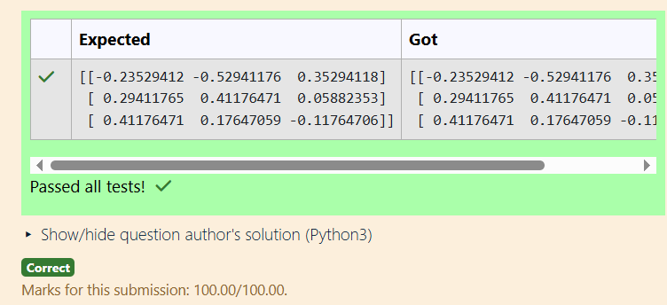

# EX2-INVERSE-OF-A-MATRIX
## AIM:
To write a python program to find the inverse of a matrix
## EQUIPMENT'S REQUIRED:
1. 	Hardware – PCs
2. 	Anaconda – Python 3.7 Installation / Moodle-Code Runner
## ALGORITHM:
### Step 1:
Import the numpy module to use its built-in mathematical functions.
### Step 2:
Create a matrix and assign it to a variable using np.array().
### Step 3:
Using the np.linalg.inv(), find the inverse of the given matrix.
### Step 4:
Display the result and end the program.
## PROGRAM:
```
#Program to find the inverse of a matrix.
#Developed by: Latkshaya S
#RegisterNumber: 25009540
import numpy as np
A=np.array([[1,0,3],[-1,2,-2],[2,3,-1]])
x=np.linalg.inv(A)
print(x)

```
## OUTPUT:

## RESULT:
Thus the inverse of given matrix is successfully solved using python program

